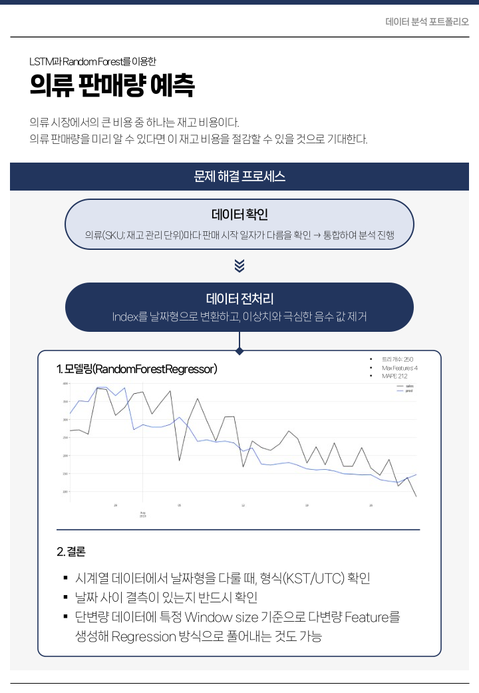
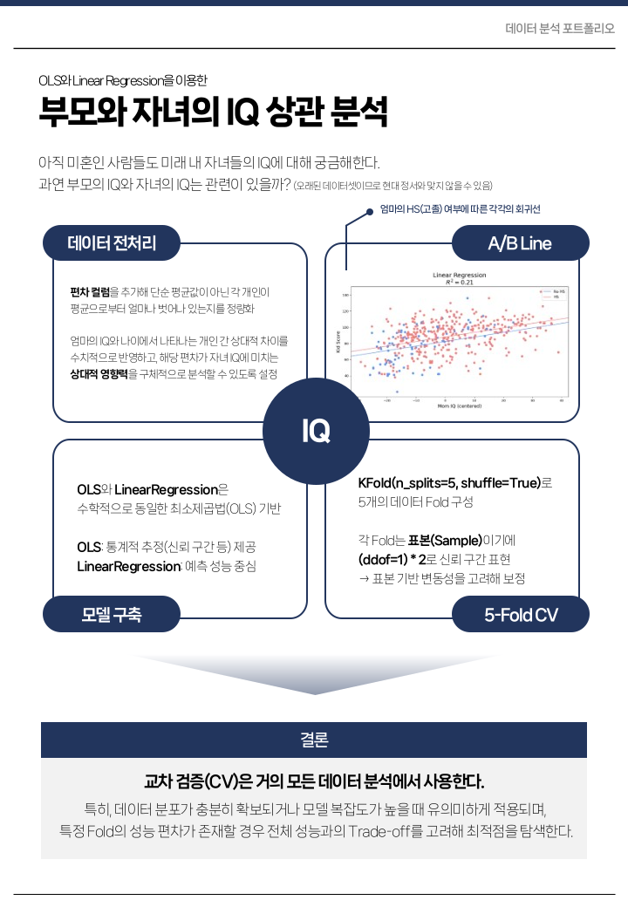

# Machine Learning Portfolio

데이터를 기반으로 문제를 정의하고, 모델링을 통해 해답을 찾아가는 과정을 담은 포트폴리오입니다.  
각 프로젝트는 **문제 정의 → 데이터 확인 → 문제 해결 프로세스 정의 → 데이터 전처리 → 모델링 → 인사이트 도출**과 같은 전체적인 데이터 분석 과정을 포함하고 있습니다.

---

> 각 프로젝트 폴더 안에는 다음 파일들이 포함되어 있습니다.
> - `notebook.ipynb`: 분석 코드 전체
> - `README.md`: 분석 코드 개요
> - `report.png`: 프로젝트 1장 요약(1-pager)

---

## 프로젝트 목록

| 프로젝트 주제 | 주요 기법 | 미리 보기 | 링크 |
|:----------|:-----------|:---------|:-----|
| 👕 의류 판매량 예측 | Darts RNNModel(LSTM), Random Forest Regressor | **[미리 보기](#1-의류-판매량-예측)** | [상세 보기](./1_apparel_sales_forecasting/) |
| 🏥 당뇨 환자 재입원 예측 | LightGBM Classifier, Optuna | **[미리 보기](#2-당뇨-환자-재입원-예측)** | [상세 보기](./2_diabetes_readmission_prediction/) |
| 👩🏻‍👦🏻 부모와 자녀의 IQ 상관 분석 | OLS Regression, Linear Regression | **[미리 보기](#3-부모와-자녀의-iq-상관-분석)** | [상세 보기](./3_parent_child_iq_correlation/) |
| ☁️ 공기질 데이터 분석 | 각종 Regressor, Support Vector Machine | **[미리 보기](#4-공기질-데이터-분석)** | [상세 보기](./4_air_quality_humidity_regression/) |
| 🏥 유방암 환자 분류 | 각종 Classifier, KNN, Linear Discriminant Analysis | **[미리 보기](#5-유방암-환자-및-6-흡연-여부-분류)** | [상세 보기](./5_breast_cancer_classification/) |
| 😮‍💨 흡연 여부 분류 | 각종 Classifier, KNN, Linear Discriminant Analysis | **[미리 보기](#5-유방암-환자-및-6-흡연-여부-분류)** | [상세 보기](./6_smoking_status_classification/) |
| 🐕 유기견 입양 소요 기간 분석 | Logistic Regressor, Neural Network | **[미리 보기](#7-유기견-입양-소요-기간-분석)** | [상세 보기](./7_pet_adoption_duration_analysis/) |
| 💳 신용카드 이상거래 분류 | Logistic Regressor, KNN, Linear Discriminant Analysis | **[미리 보기](#8-신용카드-이상거래-탐지)** | [상세 보기](./8_creditcard_fraud_detection/) |
| ⚡ 공조기기 전력 사용 상태 분석 | Random Forest Classifier | **[미리 보기](#9-공조기기-전력-사용-상태-분석)** | [상세 보기](./9_hvac_soh_prediction/) |

---

## 프로젝트 요약

### 1. 의류 판매량 예측
> LSTM과 RandomForest를 이용한 시계열 데이터 분석

  

**핵심 내용**
- 국내·해외 간 판매 패턴 차이를 고려해 국내 데이터만 선별 후 분석 진행
- 날짜형 Index 변환 및 특정 Window size 기반 Feature engineering 수행
- 시스템 오류로 인한 결측·이상치 구간을 제거해 안정적인 시계열 구조 확보
- 2019년 여름 시즌 이전을 Train set, 그 이후를 Test set으로 분리
- darts 기반 LSTM(RNNModel)과 RandomForestRegressor를 병행해 단변량·다변량 예측 성능 비교

---

### 2. 당뇨 환자 재입원 예측
> LightGBM과 환자의 입원 관련 정보를 이용한 재입원 가능성 예측

  

**핵심 내용**
- OpenML의 당뇨 환자 데이터셋에서 타겟과 직접적으로 연관된 변수를 제거하고 One-Hot 인코딩 수행
- 학습·평가용으로 데이터를 Train(70%)/Test(30%)로 분리하고, 성능 평가 함수 직접 정의
- 클래스 불균형 문제를 해결하기 위해 scale_pos_weight 조정 및 Optuna 하이퍼파라미터 튜닝 수행
- 모델 성능을 Precision, Recall, ROC-AUC, F1 등 다양한 지표로 평가하며, FP/TN 비율 제약을 두어 중증 환자 탐지 강화
- 최적화 결과, Recall 중심의 재입원 예측 모델을 구축하고, 임계값 조정 후처리로 예측 안정성 개선

---

### 3. 부모와 자녀의 IQ 상관 분석
> OLS와 LinearRegression을 이용한 어머니와 자녀의 IQ 상관 분석

  

**핵심 내용**
- 엄마의 IQ·나이 편차 컬럼을 추가해 평균 대비 개인 차이 반영
- A/B Line 시각화로 고등학교 졸업 여부에 따른 선형 관계 차이 시각적으로 확인
- 부모와 자녀의 IQ 데이터를 활용해 OLS와 Linear Regression 기반 상관 분석 모델 구축
- 5/10-Fold 교차검증을 통해 R²와 RMSE 기준으로 모델의 일반화 성능 검증
- 추가로 상호작용항인 mom_hs_iq_c = mom_hs * mom_iq_c 생성 후 동일한 KFold 평가 루프 구성

---

### 4. 공기질 데이터 분석
> 다양한 Regression 기법을 이용한 공기질 데이터 분석

  

**핵심 내용**
- 상대습도(RH)와 대기 내 주요 대기 물질 농도 간의 상관관계를 분석하기 위해 공기질 데이터셋 활용
- DATE, TIME 컬럼에서 월(MONTH)·시(HOUR) 정보를 추출해 시간대별 공기질 특성 반영
- Linear·Logistic·Decision Tree·Random Forest·SVR의 다섯 가지 회귀모델 비교 평가
- RMSE 기준으로 Random Forest가 가장 낮은 오차(≈0.73)로 최적의 성능 보유
- RH가 연속형 변수이므로 Logistic보다는 범주형 혼합 특성을 포착할 수 있는 Random Forest가 가장 적합하다는 결론 도출

---

### 5. 유방암 환자 및 6. 흡연 여부 분류
> 다양한 Classifier 모델을 이용한 유방암 환자/흡연 여부 분류

  

**핵심 내용(유방암)**
- Logistic Regression, LDA, SVM, KNN, RandomForest를 이용해 악성 종양(M)과 양성 종양(B)을 구분하는 이진 분류 문제
- 불필요한 Unnamed: 32 컬럼을 제거 후, diagnosis를 M→malignant, B→benign으로 매핑하여 타깃 변수 정제
- 데이터를 70% 학습 / 30% 평가로 분리하되, stratify=y를 적용해 클래스 비율 유지
- 각 모델 테스트 결과, Logistic Regression이 정확도 0.9649, 악성 예측 Recall 0.9219로 가장 우수했으며, SVM과 LDA가 뒤를 이음
- Precision, Recall, F1, ROC-AUC, Cohen’s Kappa 등 다양한 지표를 통해 모델의 진단 민감도와 신뢰도를 종합적으로 검증

**핵심 내용(흡연 여부)**
- Logistic Regression, KNN, LDA, SVC를 이용해 건강검진 데이터 기반 흡연자 여부를 분류하는 이진 분류 문제
- 이상치(시력 10.0 등)를 연령대별 중앙값으로 대체하고, 극단값이 존재하는 변수는 RobustScaler로 정규화하여 안정적 입력 데이터 구성

---

### 7. 유기견 입양 소요 기간 분석
> Logistic Regression과 Neural Network를 이용한 유기견 입양 소요 기간 분석

  

**핵심 내용**
- 사진 수·설명 길이·단어 수 등 텍스트 기반 파생 변수를 생성해 입양 확률에 미치는 영향 분석
- `PhotoAmt`를 중심으로 한 로지스틱 회귀(Logit) 모델에서 사진 수 1단위 증가 시 입양 확률 약 5.6%p 상승 확인
- `DescriptionLength` 역시 1단위 증가 시 약 2%p 확률 상승하며, 설명의 풍부함이 입양 성공에 긍정적 영향을 미침
- RandomForest 기반 변수 중요도 분석 결과, 사진 수·설명 길이·나이가 주요 결정 요인으로 도출
- TensorFlow 신경망 모델을 추가해 다변량 관계를 학습한 결과, 약 72% 정확도로 유의한 예측 성능 확보

---

### 8. 신용카드 이상거래 탐지
> Under-Sampling과 Linear Discriminant Analysis를 이용한 신용카드 이상 거래 탐지

  

**핵심 내용**
- 정상 284,315건(99.83%) vs 이상거래 492건(0.17%)의 극단적인 불균형 구조를 5% 랜덤 Under-sampling으로 조정해 학습 가능한 데이터셋 구성
- Logistic·KNN·SVM·RandomForest와 비교한 결과, LDA가 Fraud Recall 0.75로 가장 안정적인 탐지 성능 확보
- Sigmoid 커널 기반 SVM은 비선형 구조를 충분히 펼치지 못해 Fraud Recall 0.50으로 낮은 성능을 보임
- Permutation Importance 분석에서는 v1·v4·v5·v28 등이 높은 기여도를 보였으나, RandomForest 자체의 학습 한계로 인한 해석력 제약 존재
- Over-sampling(1:1) 적용 시 오히려 오탐 증가 및 F1-score 급락(0.10대로 하락)을 확인하며, 실제 분포를 유지한 Under-sampling의 우수성 검증

---

### 9. 공조기기 전력 사용 상태 분석
> 현재 진행 중

**핵심 내용**
- 현재 진행 중

## 향후 계획
- `10. 가스 공급량 예측 모델링` 데이터 확인 예정